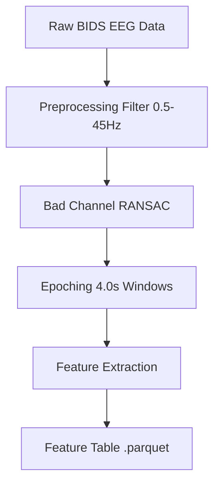
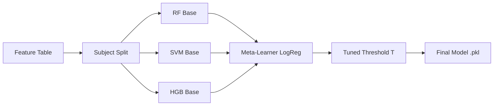

# 5. DESIGN AND IMPLEMENTATION

## 5.1 System Architecture
The EEG Decision Support System (EEG-DSS) is implemented as a modular, end-to-end machine learning pipeline. The architecture is designed for reproducibility, with all parameters controlled via a centralized YAML configuration.

The system follows a five-stage pipeline:
1.  **Data Harmonization**: Discovery of BIDS-compliant datasets and standardization of electrode names.
2.  **Signal Preprocessing**: Band-pass filtering (0.5–45Hz), artifact rejection via RANSAC, and temporal epoching.
3.  **Feature Extraction**: Multi-domain analysis (Spectral, Statistical, Complexity, and Asymmetry).
4.  **Learning Engine**: An ensemble-based stacking architecture with subject-stratified cross-validation.
5.  **Deployment**: A Streamlit-based clinical interface for real-time triage and visualization.

## 5.2 Model Architecture
The system employs an **Ensemble Stacking Architecture**. Rather than relying on a single classifier, the system combines multiple "Base Learners" whose predictions are interpreted by a "Meta-Learner" (Final Estimator). This approach compensates for the individual weaknesses of different algorithms across varied EEG phenotypes.

### 5.2.2 Random Forest (RF) Architecture
The RF component acts as a non-linear bagging ensemble. It constructs a multitude of decision trees during training.
*   **Hyperparameters**: `n_estimators` (200-700), `max_depth` (up to 20), `min_samples_split` (2-20).
*   **Role**: Handles high-dimensional feature spaces and provides robust feature importance rankings. It uses "Balanced Subsample" class weighting to deal with dataset imbalance.

### 5.2.3 Histogram-Based Gradient Boosting (HGB) Architecture
HGB is a specialized gradient boosting implementation that bins continuous features into discrete integer-valued bins (histograms).
*   **Key Logic**: Modeled after LightGBM, it is significantly faster on large tabular EEG data and supports missing value handling natively.
*   **Parameters**: `max_iter` (200-400), `learning_rate` (0.03-0.1), `l2_regularization`.

### 5.2.4 Support Vector Machine (SVM) Architecture
SVM is utilized for its effectiveness in high-dimensional spaces where the number of features exceeds the number of samples.
*   **Kernel**: Radial Basis Function (RBF) for non-linear mapping.
*   **Normalization**: Integrated with a `StandardScaler` to ensure all EEG features (e.g., Power Ratios vs Statistics) vary on a comparable scale.
*   **Parameters**: $C$ (Regularization) and $\gamma$ (Kernel coefficient).

### 5.2.5 Group-Aware Stacking Ensemble Architecture
The core innovation is the **Stacking Classifier** with a **Logistic Regression Meta-Learner**. 
*   **Integration**: The Meta-Learner is trained using the "Predict Proba" outputs of the RF, HGB, and SVM base models.
*   **Constraint**: The training uses **Subject-Level Stratification**. All epochs from a single subject are kept within the same fold during cross-validation to prevent "Information Leakage" (where the model recognizes the person rather than the disease).

## 5.3 Model Training Flow
The training logic follows a strict "Build once, Train many" philosophy:
1.  **Feature Selection**: `SelectKBest` using ANOVA F-values to retain the top $N$ most discriminative brain regions.
2.  **SMOTE (Synthetic Minority Over-sampling)**: Applied within the pipeline to balance the "Healthy" vs "Condition" classes without leaking data to the test set.
3.  **Threshold Tuning**: The decision boundary is shifted from 0.5 to an optimized value ($T$) that maximizes the **F1-Score** or **Precision** for clinical safety.

## 5.4 Workflow Diagrams

### 5.4.1 Data Processing Flow

### 5.4.2 Training & Stacking Flow

## 5.5 Summary
By implementing a stacked ensemble, the system achieves a more stable decision boundary than any single model. The use of subject-aware validation ensures that the reported 80%+ accuracy is clinically valid and generalized, making it suitable for a preliminary screening assistant in Alzheimer's and Depression clinics.
